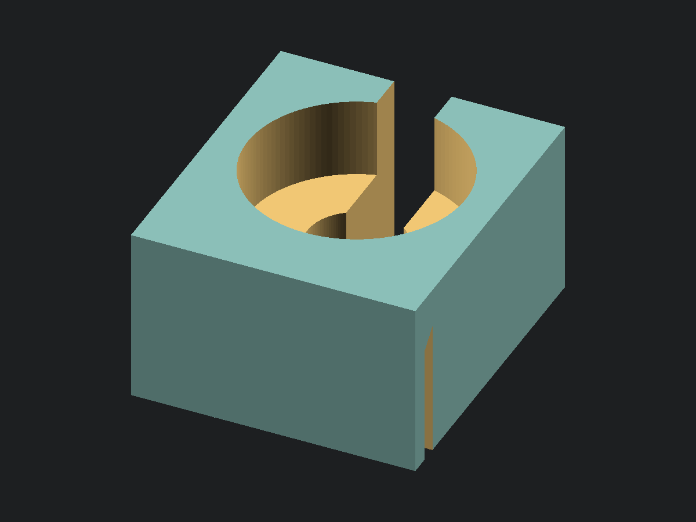

<!-- SPDX-License-Identifier: CC-BY-4.0 -->
# Single screwdriver holder

[](single_screwdriver_holder.stl)

[STL](single_screwdriver_holder.stl) · [OpenSCAD source](single_screwdriver_holder.scad)

A rectangular socket for one long screwdriver, with a narrow front opening
and a downward-opening rear channel that straddles an accessory hanger strip.
Keep the screwdriver upright, move its shaft horizontally into the opening,
then lower the handle into the upper pocket. Lift it clear before withdrawing
it forward. There is no need to thread the full shaft through from above.

The upper pocket surrounds the bottom of the handle and supports it on an
upward-facing shoulder. An optional middle pocket clears a wider neck or hex
bolster; the smallest bore exits through the bottom. One constant-width slot
cuts through all three levels. The handle is retained against sliding out
forward while seated; clearance permits some play and a circular socket does
not prevent rotation. Capture depends on the actual handle shape.

## Measure and tune

**All shipped measurements are examples, not measured Wall Control dimensions.**
Defaults describe an 8 mm shaft, 32 mm handle, and 14 mm bolster projecting
10 mm below the handle. The hanger examples are 2 mm thick, 40 mm tall, with
8 mm clear behind it. Measure your hardware before printing a fitted version.
All dimensions are millimetres.

| Input | Where to measure | Caliper |
| --- | --- | --- |
| `shaft_d` | Largest outside width of the shaft section that passes sideways through the slot; across corners for a hex shaft | 6 in |
| `handle_d` | Largest outside width over the entire handle portion entering the socket | 6 in |
| `bolster_d` | Maximum outside width of the wider neck, across corners for a hex | 6 in |
| `bolster_l` | From the handle's seating shoulder to the end of the wider neck | 6 in |
| `hanger_thickness` | Across the strip including its coating | 6 in |
| `hanger_wall_gap` | Clear distance from the back of the strip to the wall | 6 in |
| `hanger_height` | Top edge to bottom edge of the strip | 6 in |

Set `middle_bore = false` for a shaft that meets the handle directly. With it
enabled, the middle pocket depth is `bolster_l + bolster_end_clearance`, so the
handle seats before the bolster bottoms out. The handle must have a shoulder
wide enough to bear on the remaining seat. Rounded or strongly tapered handles
may seat at a different height and require a shallower `handle_depth` or a
different diameter. Check the actual seating before relying on the holder.

`handle_depth` defaults to 12 mm. `diameter_clearance` adds 0.6 mm to each
bore diameter and to the front slot width, giving an 8.6 mm slot throughout.
It is total diametral clearance, not clearance per side. The shaft must enter
with the handle and any bolster above the holder; with the default bolster,
allow roughly 22 mm of upward travel from the seated position before moving
the screwdriver forward. Also leave room for your hand and the handle above.

The rear mounting channel is open at the bottom and both sides. Its width is
`hanger_thickness + hanger_clearance`; its lowest roof edge is
`hanger_engagement` above the bottom. A 3 mm rear lip fits behind the strip.
The sloped roof contacts the strip's top edge rather than bearing across its
whole thickness. This is a gravity-mounted slip fit: it can slide along the
strip and lift off. It has no sideways lock or anti-lift latch. Check that
removing the screwdriver does not lift the holder with it.

The block width and depth follow the handle bore, wall thickness, and mounting
channel. Height is the larger of the socket stack and the height needed for
the mounting channel plus `roof_meat`. If the mount requires extra height,
material grows beneath the socket stack; the handle pocket stays its requested
depth. Defaults produce a 42.6 × 48.1 × 26.5 mm block. Assertions guard the
handle shoulder, back clearance, wall thicknesses, and pocket depths. Echoes
report the resulting dimensions and openings.

## Printing

Print as modelled: socket up, rear mounting channel opening down, and the flat
bottom on the bed. The socket shoulders face upward. The mounting channel roof
rises by exactly its width, fixing its downward-facing slope at 45° from
vertical; this is the worst overhang. No supports are intended. The rear lip
and main body start on the bed and join at the sloped roof.

The model is a starting point for a fit test, with no established load rating
or physical testing. Check the hanger engagement and handle seating before
using it for a long, heavy screwdriver. Slicing and build-plate placement are
left to the slicer. Rebuild the STL and preview after changing parameters:

```sh
scadformat single_screwdriver_holder/single_screwdriver_holder.scad
python3 scripts/build.py single_screwdriver_holder/single_screwdriver_holder.scad
```
